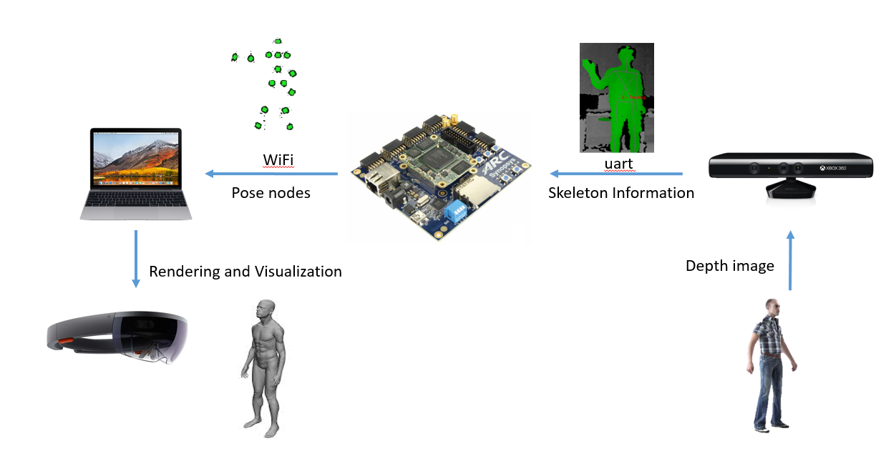
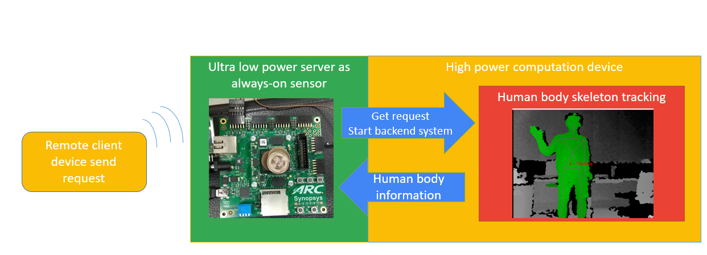

# EMSK ARC 3D Remote Communication and Interaction
- [Introduction](#Introduction)
- [Required Hardware](#Required-Hardware)
- [Require Software](#Require-Software)
- [Hardware Connection](#Hardware-Connection)
- [Architecture](#Architecture)
- [User Manual](#User-Manual)
    - [Installations](#Installations)
        - [FTDI FT2232 dirver](#FTDI-FT2232-dirver)
        - [OpenNI](#OpenNI)
    - [Usage](#Usage)
        - [PC](#PC)
        - [ARC](#ARC)
        - [Client](#Client)

## Introduction

## Required Hardware
* DesignWare ARC EM Starter Kit(EMSK)
* ESP8266 WiFi module
* FTDI FT2232 usb to UART module
* WiFi Hotspot
* Depth camera module (PC + Kinect) 
* client (HoloLens, PC, Smart phone, etc.)

## Require Software
* Metaware or ARC GNU Toolset
* OpenNI
* Robot OS (ROS)
* Client display

## Hardware Connection

  

## Architecture

The communication system is driven by EMSK ARC, which is a low power always on processor, waiting until one make a call and then power up the depth camera system.  

We can get human skeleton by **depth camera module**. (In our case we use kinect and PC and get skeleton by OpenNI skeleton algorithm.)  
Then we using **ROS** to integrate to environments (camera informations, skeleton informations and ftdi transition) and sent the detected skeleton to ARC through **FTDI FT2232** chip.  

The **EMSK ARC**, which serve as the low power server, collect the detected skeleton and process the skeleton nodes let the client can easliy handle these informations. The connection between the client and ARC is the socket portocal and ARC will send the infomations to client by **ESP8266 WiFi module**.  

The client (At least PC, we use extra device to make more usage scenarios) recieve the infomations and apply the human body pose to the 3D hologram with few computations and we will able to interact with the hologram!  

# User Manual
## Installations
There are some pre-request software dependencies to run our work.

### FTDI FT2232 dirver 
Refer the download page of [libftdi1](https://www.intra2net.com/en/developer/libftdi/download.php)

### Robot OS (ROS)
Refer to the [ROS offical](http://wiki.ros.org/kinetic/Installation) site for the installation informations

### OpenNI 
installation steps:

First install the openni and kinect driver

    $ mkdir ~/src
    $ cd ~/src
    $ git clone https://github.com/avin2/SensorKinect
    $ cd SensorKinect/Bin
    $ tar xjf SensorKinect093-Bin-Linux-x64-v5.1.2.1.tar.bz2
    $ cd Sensor-Bin-Linux-x64-v5.1.2.1
    $ sudo ./install.sh
    
Then install the human body skeleton tracking

    $ cd ~/catkin_ws/src (change to match your catkin workspace directory)
    $ git clone -b hydro-devel https://github.com/pirobot/skeleton_markers.git
    $ cd ~/catkin_ws
    $ catkin_make
    $ rospack profile

## Usage
There are three part to start our work. PC for human body tracking [TODO], ARC platform, Client [TODO]  

### PC [TODO]

### ARC platform
1. Start the EMSK ARC to wait for call.

2. User make a call to EMSK, then the EMSK ARC will poewer up the depth camera module and sent the detect human body infomations back.

3. The ARC will process the recieve skeleton andsent the informations to client.

### Client [TODO]
